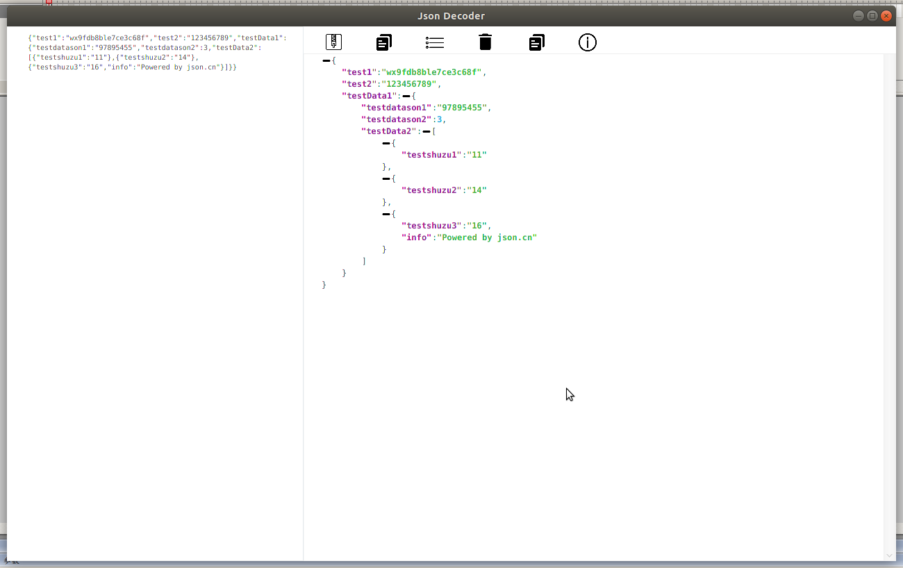

# JsonDecoder

> Offline Json decode tools
> Powered by [json.cn](https://www.json.cn/)

### Why make this ?

[json.cn](https://www.json.cn/) is a very useful website to format Json data.Want to use this website when computer offline.that's why make this simple applicaiton.

### Notice!

The core code is written by [json.cn](https://www.json.cn/), I just collect the html, css, js file and packaged into an simple application.(I just replace some image resource and modifield a little bit code)

### Before running

require java10 environment and javafx support    :)

### Preview

